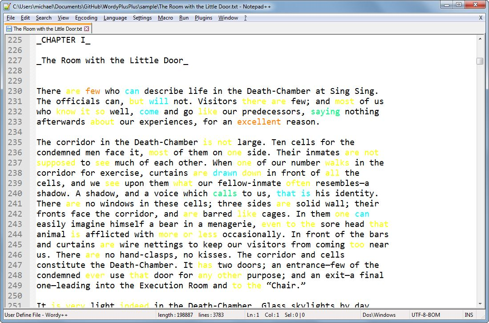

# Wordy++
A sort-of syntax highlighter for Notepad++ based on Reedes' vim-wordy. 

### History
[vim-wordy](https://github.com/reedes/vim-wordy) is a vim plugin that:

>is not a grammar checker. Nor is it a guide to proper word usage. Rather, wordy is a lightweight tool to assist you in identifying those words and phrases known for their history of misuse, abuse, and overuse, at least according to usage experts.

In other words vim-wordy uses a bunch of wordlists to flag various issues in your prose. 

**Wordy++** implements the most useful of these lists (imho) in Notepad++ via a user defined language (highlighter)

**Wordy++** uses the following wordlists from vim-wordy:

* passive voice (blue)
* redundant terms (red)
* said-synonyms (green)
* weak language (yellow)
* weasel words (orange)

### Install
Language > Define your language > Import

### Usage 
Wordy++ is not linked to any filetype. It is designed to be used on demand. 

## Screenshot
